 
## 查看主页获取源码

> **作者介绍**： **✌**全网粉丝10W+本平台特邀作者、博客专家、CSDN新星计划导师、java领域优质创作者,博客之星、掘金/华为云/阿里云/InfoQ等平台优质作者、专注于项目实战 **✌**

  

### 一、作品包含

源码+数据库+设计文档万字+PPT+全套环境和工具资源+部署教程

### 二、项目技术

前端技术：Html、Css、Js、Vue、Element-ui

数据库：MySQL

后端技术：Java、Spring Boot、MyBatis

  

### 三、运行环境

开发工具：IDEA/eclipse + 微信开发者工具

数据库：MySQL5.7

数据库管理工具：Navicat10以上版本

环境配置软件： JDK1.8+Maven3.6.3

前端Nodejs：14

### 四、项目介绍
项目编号：mpweixinA033

在知识经济时代，终身学习已成为个人职业发展和素质提升的必要条件。成人教育小程序应运而生，旨在为广大成年学习者提供便捷、高效的教育服务。这款小程序结合了成人学习的特点，满足成人群体在时间碎片化、学习需求多样化等方面的需求。小程序的推出，不仅打破了地域和时间的限制，降低了学习成本，还通过个性化的学习路径推荐，帮助成人学习者提升自我，实现职业生涯的再次飞跃。

前台用户功能：首页、课程资源、教育资讯、测试、我的收藏管理、测试资源列表、测试记录、错题本。

后台管理员的功能：系统首页、个人中心、会员管理、课程类型管理、课程资源管理、测试资源管理、系统管理、测试管理。

### 五、运行截图

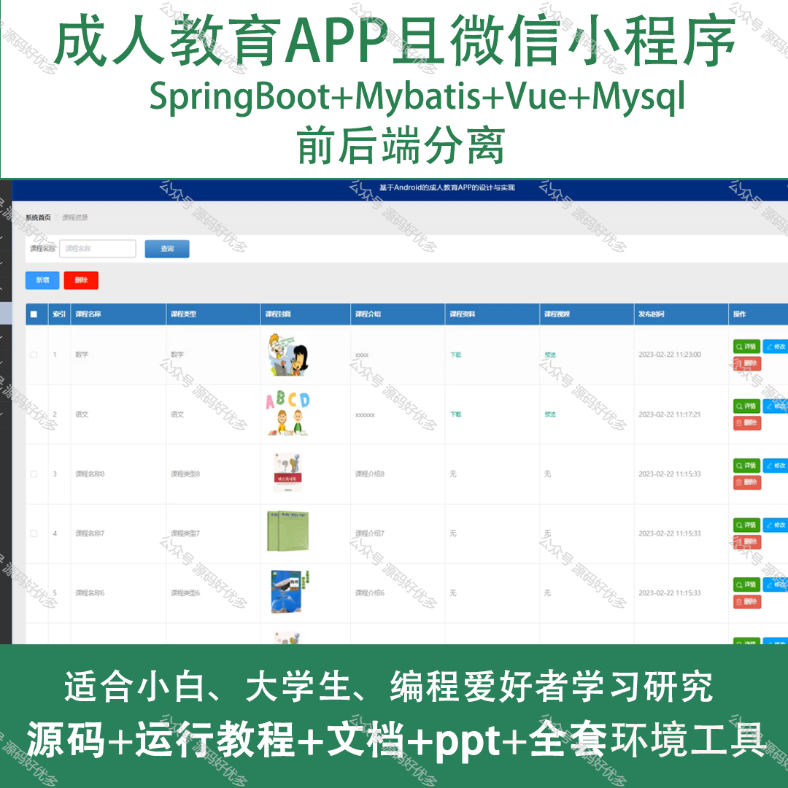
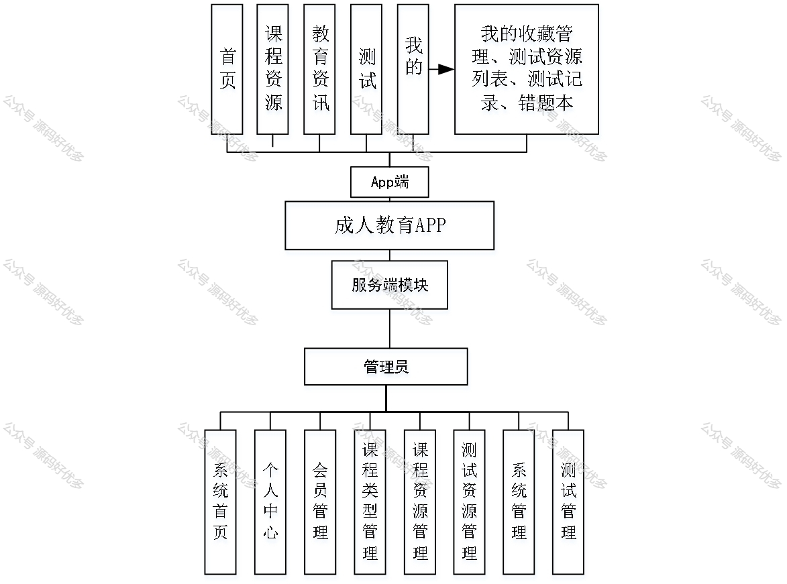
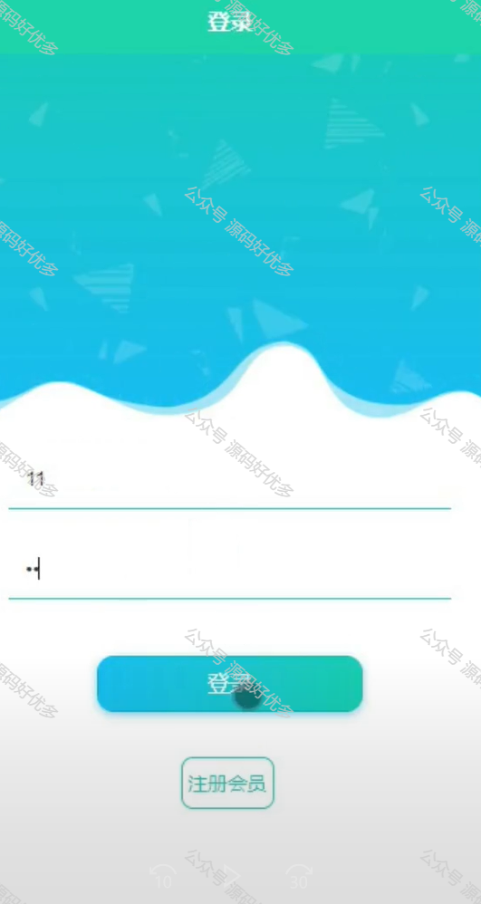
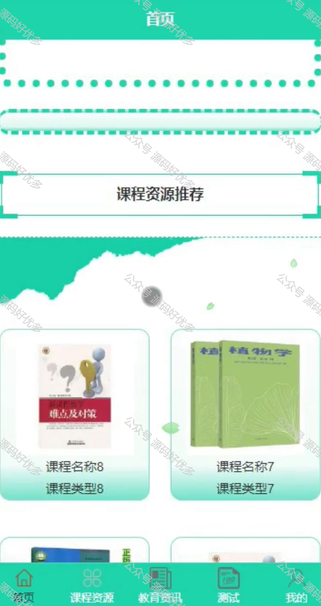
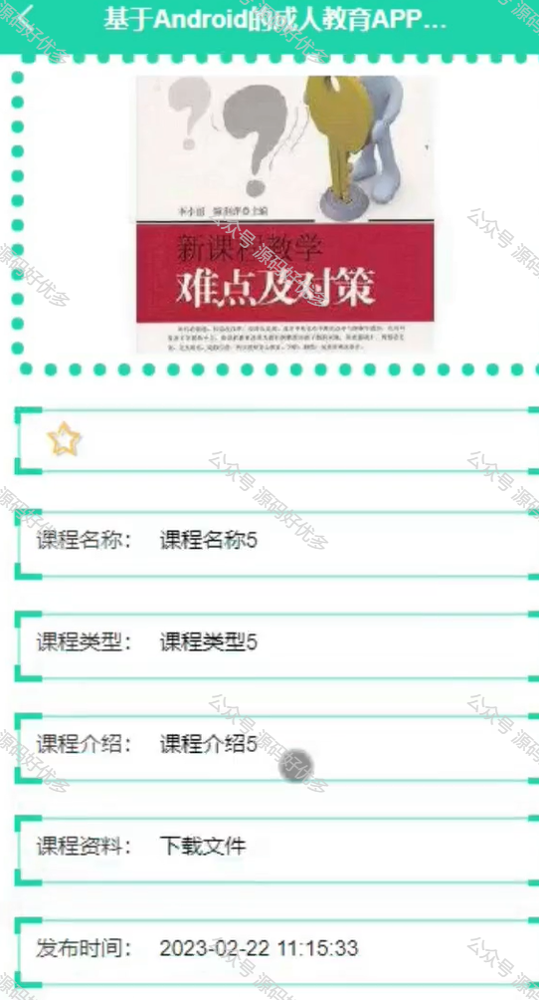
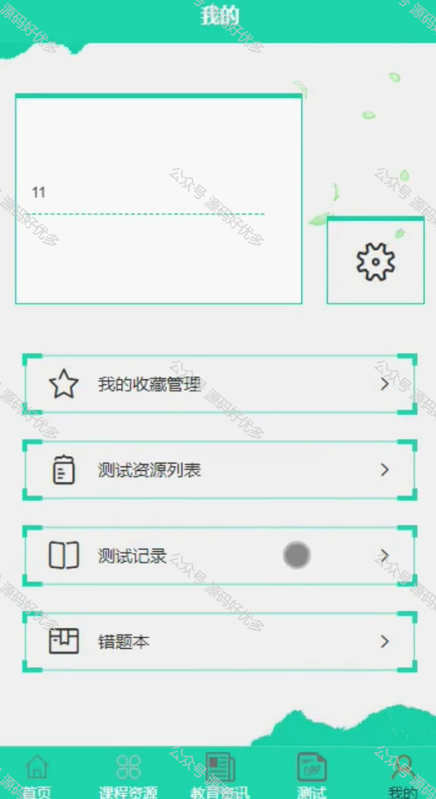
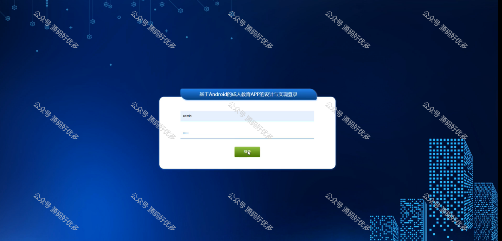
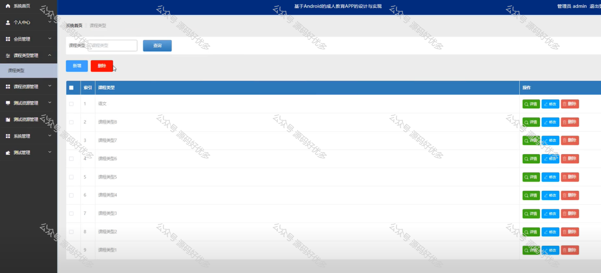
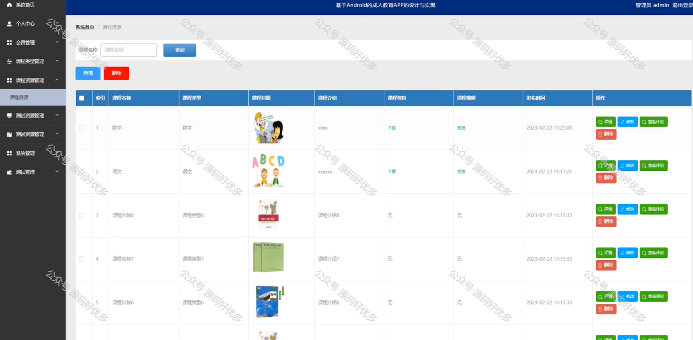
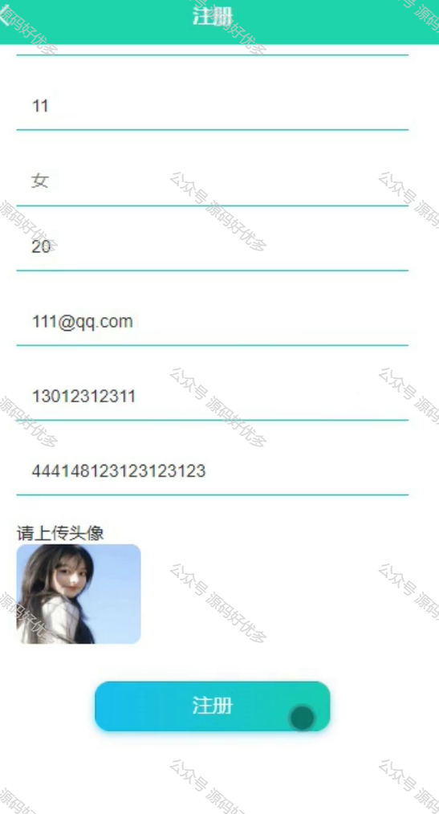
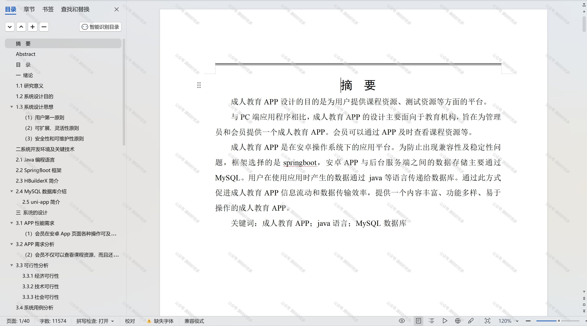

  
